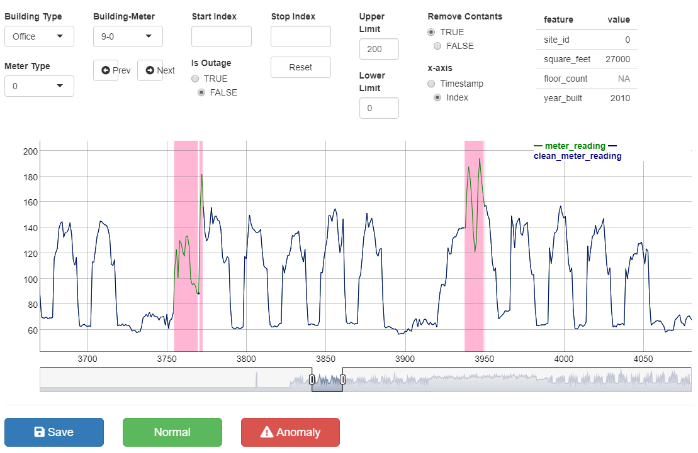

### The `AnomalyAnnotator` is a R-Shiny based web application to annotate the anomalies in energy meter time series. 

### Credits
1. The winners [Isamu & Matt Motoki](https://www.kaggle.com/competitions/ashrae-energy-prediction/discussion/124709) of the [ASHRAE - Great Energy Predictor III](https://www.kaggle.com/competitions/ashrae-energy-prediction/) comppetition.
